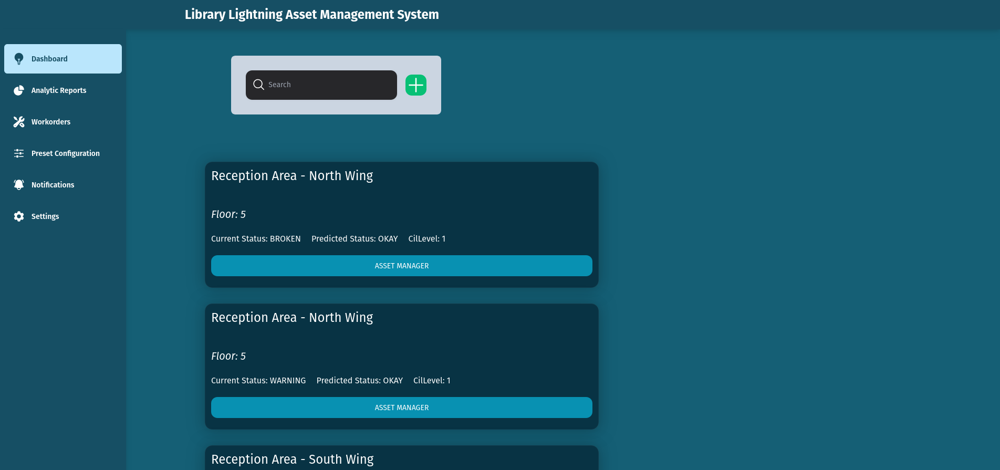
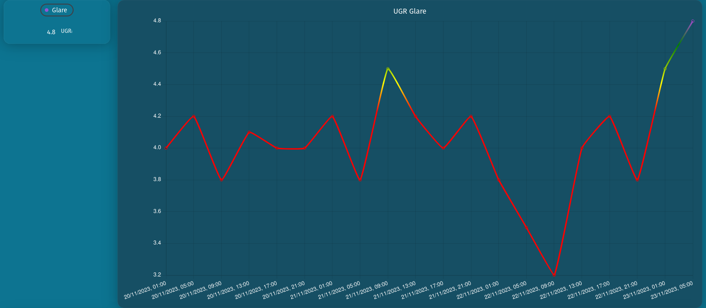
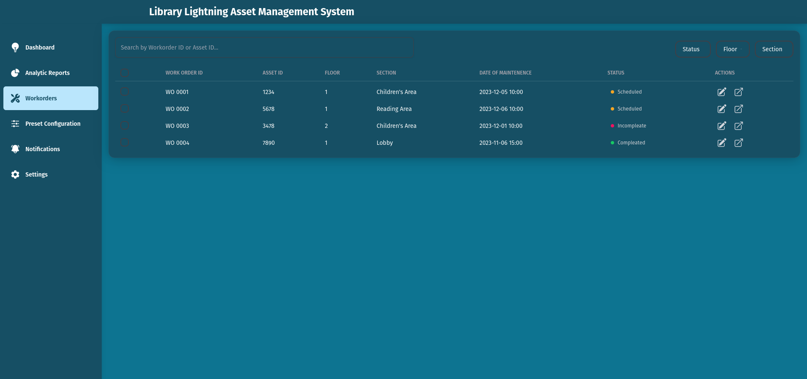

# Library Light Twin

[Proyect description in FER website](https://www.fer.unizg.hr/rasip/dsd/projects/digitaltwin/project_description)

The goal of this project is to provide a digital twin for light asset
managment in libraries. In other words, it allows the client to control
the lights in  a library, as well as read about the state of the
lights, their health, and to prevent any sort of  issues with them. It
also allows them to send out work orders to another person with the role
of fixing the lights, should any issues arise. This is a proof of
concept, that uses a  database with all the information already there,
instead of a real library.

The technologies used have been:

* NodeJS, Serverless, apollo server, and mongodb for the [backend](https://github.com/Library-Light-Twin-DSD2023-MDU-POLIMI/digital-twin-dsd-backend)
* React, nextjs, and the apollo client for the [frontend](https://github.com/Library-Light-Twin-DSD2023-MDU-POLIMI/digitaltwin)

Group members:

* Sankeethan Sivachandran
* Victoria Kallerud
* Lea Jahren Andersen
* Karen Seim Midtlien
* Pauline Herbain
* Juan Carlos Pichardo Vicencio
* Heshani Wickramasinghe
* Mario Jiménez Redondo

